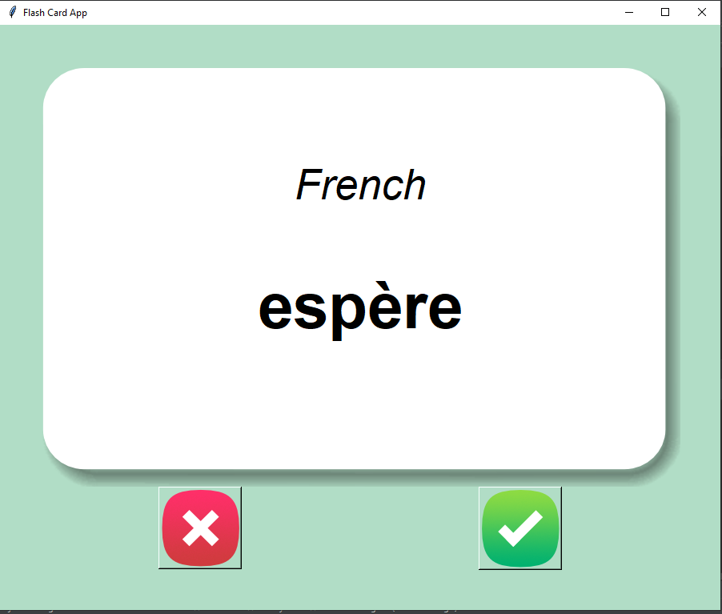
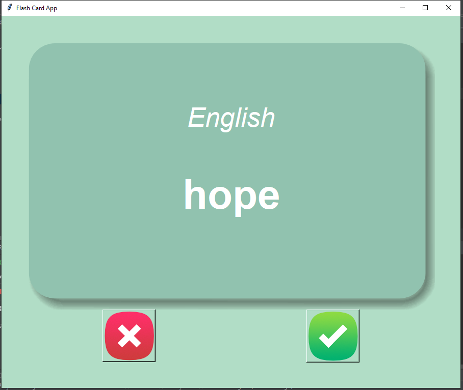
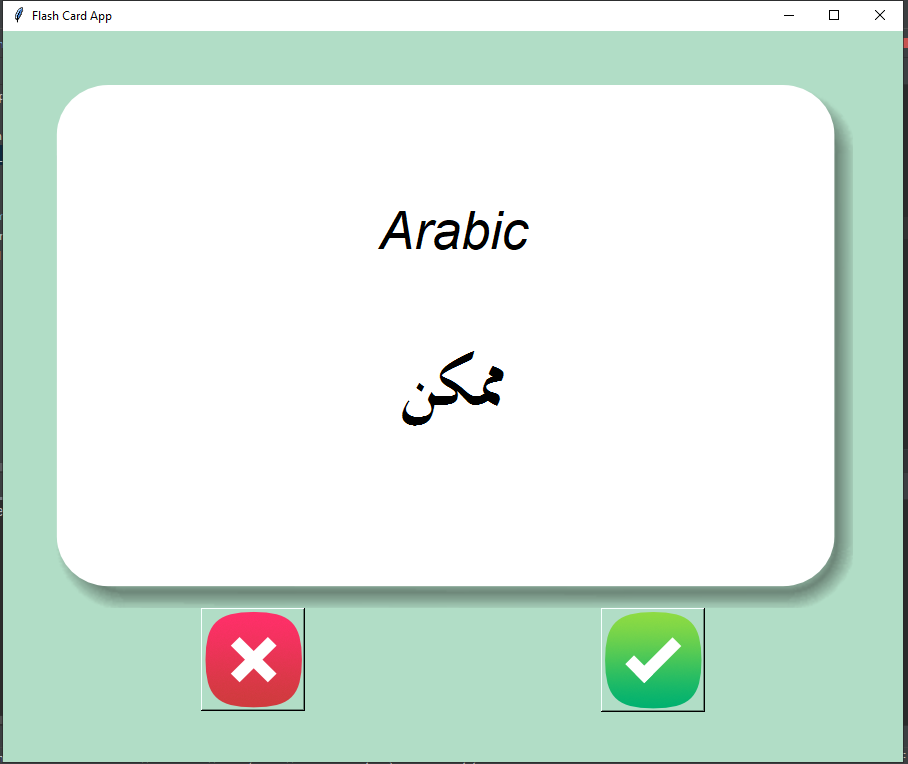
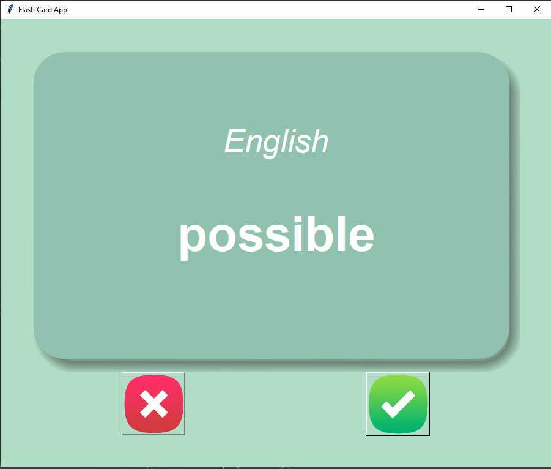

# Flash-Card-App
A smail GUI application writen in python programming language.
## Where to use this app:
-You can use this app for many things such as memorizing new words from another language.....
## How To Use The App:
- First : you have to choose the file the has the words or sentences tha you want to study and put that file in the ``./data`` 
directory then go to the main.py file and replace the ``FILE_TARGET`` variable with the name and the directory of your file that you want
to study.

- Second : replace the  ``FIRST_COLUMN`` and  ``SECOND_COLUMN`` with the name of the column1 and column2 for the csv 
target file that you want to study from.

- Third : enjoy.
Note: the app will save the words that you have known or clicked on the check mark and never show them again.
## The App Looks:

